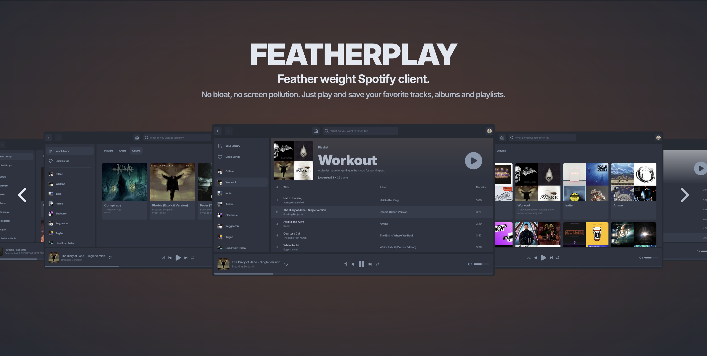

<div align="center">
  
</div>


[](https://reactrouter.com/)
[](https://react.dev/)
[](https://tanstack.com/query/latest)
[](https://vitejs.dev/)
[](https://bun.sh/)
[](https://vitest.dev/)
[](https://testing-library.com/docs/react-testing-library/intro/)
[](https://biomejs.dev)
[](https://www.docker.com/)


# FeatherPlay
<div align="center">

</div>

<div align="center">
<strong>The feather-weight, blazing fast Spotify client.
No bloat, no screen pollution. Just play and save your favorite tracks, albums and playlists.
</strong>
</div>


## Features

- 🚀 Client-side rendering for blazing fast interactivity
- ⚡️ Hot Module Replacement (HMR)
- 📦 Asset bundling and optimization
- 🔄 TanStack Query for Data loading and mutations
- 🔒 TypeScript by default
- 🎉 TailwindCSS for styling
- 📖 [React Router docs](https://reactrouter.com/)
- 🧪 Vitest + React Testing Library for testing
- 🔍 BiomeJS for code linting & formatting

## Getting Started

Before all, you must create a Spotify Developer App on the [Spotify Developer Dashboard](https://developer.spotify.com/dashboard). Use the name and description you want, but make sure the Redirect URIs is [http://127.0.0.1:5173/play](http://127.0.0.1:5173/play) (or change it to the port you are running your app locally) and <strong>both Web Playback SDK and Web API boxes are checked</strong>.

### Prerequisites

This template uses [bun](https://bun.sh/) as the package manager and Javascript Runtime. So, you need to install `bun` globally:

  ```bash
  curl -fsSL https://bun.sh/install | bash
  ```

### Installation

Install the dependencies:

```bash
bun install
```

### Development

Start the development server with HMR:

```bash
bun dev
```

Your application will be available at `http://localhost:5173`.

## Building for Production

Create a production build:

```bash
bun run build
```

## Deployment

### Docker Deployment

This template includes a Dockerfile to simplify the deployment:

To build and run using Docker:

```bash
# Build the image
docker build -t my-app .

# Run the container
docker run -p 3000:3000 my-app
```

The containerized application can be deployed to any platform that supports Docker, including:

- AWS ECS
- Google Cloud Run
- Azure Container Apps
- Digital Ocean App Platform
- Fly.io
- Railway

### DIY Deployment

If you're familiar with deploying Node or Bun applications, the built-in app server is production-ready.

Make sure to deploy the output of `bun run build`

```
├── package.json
├── bun.lockb
├── build/
│   ├── client/    # Static assets
│   └── server/    # Server-side code
```

## Linting & Formatting

[Biome](https://biomejs.dev/) is used to ensure code consistency across the project. It is already included a config file with the default + recommended options to enable when using this setup. Feel free to change it to your liking!

To run all the biome checks (linting and formatting):

```bash
bun biome check
```

To automatically fix linting issues and format code:

```bash
bun biome check --write
```

## Testing

This template uses [Vitest](https://vitest.dev/) as the testing framework and [React Testing Library](https://testing-library.com/docs/react-testing-library/intro/) for component testing. There's also included a basic setup with recommended settings.

To run the tests, use the following command:

```bash
bun run test
```

This will run all the unit and integration tests.

To watch and re-run tests on file changes during development:

```bash
bun run test:watch
```

## Styling

This template comes with [Tailwind CSS](https://tailwindcss.com/) already configured for a simple default starting experience. You can use whatever CSS framework you prefer.

---

Built with ❤️ using React Router.
